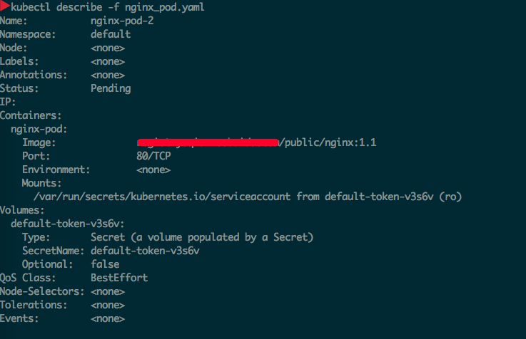
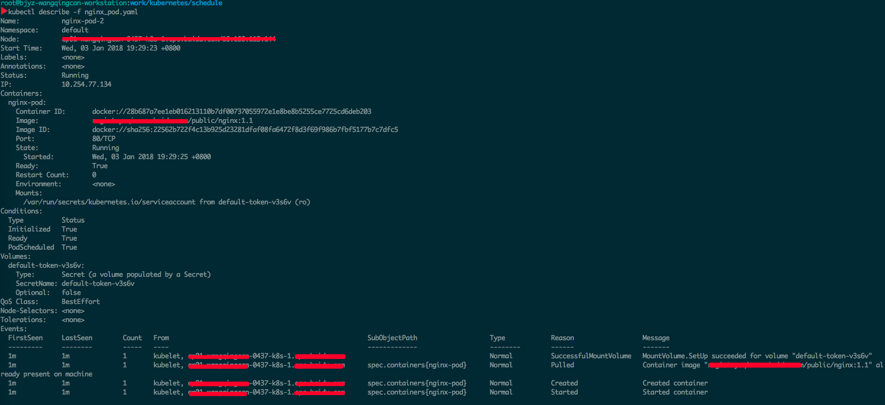

## 定制化Schedulers
### 自定义调度器
#### 官方例子—python

```python
#!/usr/bin/env python
import requests
import time
import json

SCHEDULER_NAME = "my-scheduler"
API_SERVER = "http://127.0.0.1:8080"
API_URL = {
    "pods": "/api/v1/pods",
    "nodes": "/api/v1/nodes",
    "binding": "/api/v1/namespaces/{0}/pods/{1}/binding"
}


def get_pods(url):

    pods = requests.get(url)
    pods_list = list()
    if pods.status_code == 200:
        pods_list = [{"name": x["metadata"]["name"], "namespace":x["metadata"]["namespace"]} for x in pods.json()["items"] if x["status"][
            "phase"] == "Pending" and x["spec"]["schedulerName"] == SCHEDULER_NAME]
    return pods_list


def get_nodes(url):
    nodes = requests.get(url)
    nodes_list = list()
    if nodes.status_code == 200:
        nodes_list = [x["metadata"]["name"] for x in nodes.json()["items"]]

    return nodes_list


def chose_node(nodes):
    '''scheduler'''
    chosen = None
    for node in nodes:
        if node.endswith("179"): #测试用，只是选择了ip以179结尾的节点
            chosen = node
            break
    return chosen


def main():
    pods_list = get_pods(API_SERVER + API_URL["pods"])
    nodes_list = get_nodes(API_SERVER + API_URL["nodes"])
    if pods_list == []:
        print "There is not pod need to be scheduled."
        return True

    for pod in pods_list:
        chosen = chose_node(nodes_list)
        if chosen == None:
            print "There is no node be chosen."
            return True

        data = {"apiVersion": "v1",
                "kind": "Binding",
                "metadata": {"name": pod["name"]},
                "target": {"apiVersion": "v1", "kind": "Node", "name": chosen}
                }
        bind = API_SERVER + \
            API_URL["binding"].format(pod["namespace"], pod["name"])
        headers = {"Content-type": "application/json",
                   "Accept": "application/json"}
        r = requests.post(bind, data=json.dumps(data), headers=headers)
        if r.status_code == 201:
            print "Assigned {0} to {1}.".format(pod["name"], chosen)
        else:
            print r.text
    time.sleep(3)

if __name__ == "__main__":

    while True:
        time.sleep(1)
        main()
```

#### 官方例子— shell

```shell
#!/bin/bash
SERVER='localhost:8001'
while true;
do
    for PODNAME in $(kubectl --server $SERVER get pods -o json | jq '.items[] | select(.spec.schedulerName == "my-scheduler") | select(.spec.nodeName == null) | .metadata.name' | tr -d '"')
;
    do
        NODES=($(kubectl --server $SERVER get nodes -o json | jq '.items[].metadata.name' | tr -d '"'))
        NUMNODES=${#NODES[@]}
        CHOSEN=${NODES[$[ $RANDOM % $NUMNODES ]]}
        curl --header "Content-Type:application/json" --request POST --data '{"apiVersion":"v1", "kind": "Binding", "metadata": {"name": "'$PODNAME'"}, "target": {"apiVersion": "v1", "kind"
: "Node", "name": "'$CHOSEN'"}}' http://$SERVER/api/v1/namespaces/default/pods/$PODNAME/binding/
        echo "Assigned $PODNAME to $CHOSEN"
    done
    sleep 1
done
```
#### Yaml

```yaml
apiVersion: v1
kind: Pod
metadata:
  name: nginx
  labels:
    app: nginx
spec:
  schedulerName: my-scheduler ＃指定调度器名称
  containers:
  - name: nginx
    image: nginx:1.10
```

- **spec.schedulerName** 指定自定义调度器的名称

#### 原理

​    当pod被创建的之后，状态会变成pending的状态，然后等待调度器去调度，选择适合的机器结点。此时，自定义的调度器会一直轮询，然后判断配置自己调度器的pod，根据自己的调度策略选择机器结点，选择机器结点之后building，然后kubelet会去创建容器。

- 未被调度之前，pending状态

  <div align=center>
  
  </div>

  ​

- 调度之后，running
  <div align=center>
  
  </div>


