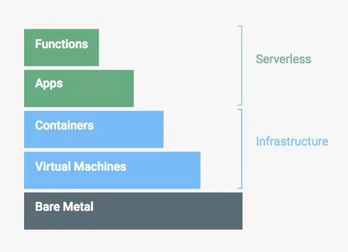
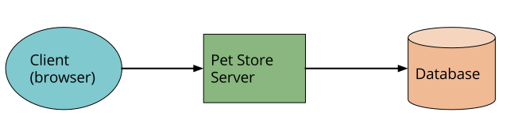
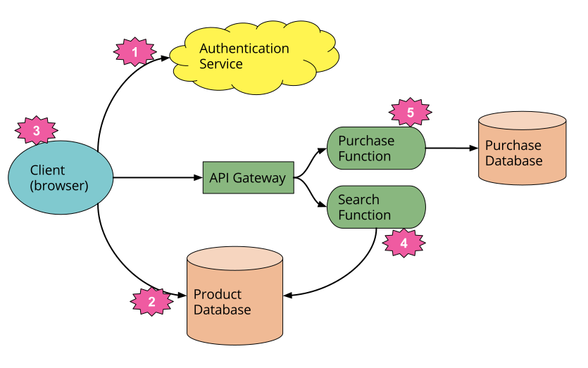
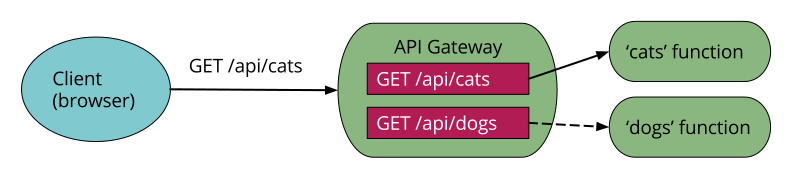

# Serverless Architectures

*Serverless architectures refer to applications that significantly depend on third-party services (knows as Backend as a Service or "BaaS") or on custom code that's run in ephemeral containers (Function as a Service or "FaaS"), the best known vendor host of which currently is AWS Lambda. By using these ideas, and by moving much behavior to the front end, such architectures remove the need for the traditional 'always on' server system sitting behind an application. Depending on the circumstances, such systems can significantly reduce operational cost and complexity at a cost of vendor dependencies and (at the moment) immaturity of supporting services.*

*Serverless架构指的是应用需要依赖第三方服务(Backend as a Service or "BaaS") 或者在短暂存在的容器中运行自定义代码(Function as a Service or "FaaS")，目前最为人熟知的是AWS的Lambda。通过使用这种架构，将更多的操作转移到前端实现，减少对后端服务器系统的依赖。基于这种*环境，可以显著的降低运营成本、对厂商的依赖以及配套服务的不成熟性。(https://martinfowler.com/articles/serverless.html)

## What is Serverless?

serverless并没有清晰的定义，它来源于两个不同但又相互重合的领域：

- **Baas**：应用大部分或者全部依赖于第三方应用或云服务用来管理服务端逻辑和状态。代表性的是富客户端的应用(例如单页面应用、移动端应用)，他们使用云端存储、权限访问等服务。
- **Faas**：应用中大量服务端的逻辑依然是由应用开发者开发，但是与传统逻辑不同的是，代码运行在无状态的计算容器中，通过事件驱动触发，短暂(可能只持续一个调用)以及完全由第三方管理。

目前普遍指的是Fass。下图来自谷歌云平台官网，是对云计算的一个很好的分层概括，其中 serverless 就是构建在虚拟机和容器之上的一层，与应用本身的关系更加密切。

### A couple of examples

#### UI-driven applications

上图是网上宠物商店的传统架构，服务端用java实现，客户端端通过HTML/Javascript实现。这种架构客户端十分简单，大量的逻辑例如权限认证、页面浏览、搜索、交易处理等都在服务端实现。

上图是Serverless架构实现。

1. 从原生的应用中把权限认证的逻辑移除，改用第三方的Baas服务
2. 改用完全由第三方维护的数据库
3. 之前在Pet Store服务端的一些逻辑现在转移到客户端中，例如保持用户的session、解读应用的用户体验结构(例如页面导航)、读取数据库和将数据转化到刻度试图中。通过这种方式，客户端实际上变成了单页面应用
4. 跟用户体验相关的功能依然保存在服务器中，例如计算密集型或者需要访问大量的数据，搜索就是典型的例子。对于搜索的功能，不再使用一直运行的服务器，而是对于API Gateway转发的请求通过实现Faas function来相应。保证客户端、server function都可以读取到相同的生产数据
5. 最后将购买的功能替换成另一个Faas function，因为安全的原因所以没有放到客户端而是放到服务端

#### Message-driven applications

另外一个是后端的数据处理服务。假设你开发了一个以用户为中心的应用，需要立刻返回用户交互的请求，但是同时你还需要捕捉到所有发生的活动。例如一个在线的广告系统，当一个用户点击广告时，你需要尽快的将用户重定向到目标广告中，与此同时你还需要收集发生的点击事件，以便于向刊登广告的人收费。

上图所示为传统的架构。Ad Server同步响应用户的操作，然后同时将信息通过管道传递到Click Processor中异步处理，最后更新数据库。

上图为Serverless的架构。不同的是使用服务商提供的时间驱动的Faas function来替换掉长期存活的普通应用。服务商提供Message传递和Faas的运行环境。对于Faas的运行环境可以通过复制多份函数代码来并发处理点击请求。

### API Gateway

API Gateway是一个HTTP服务器，